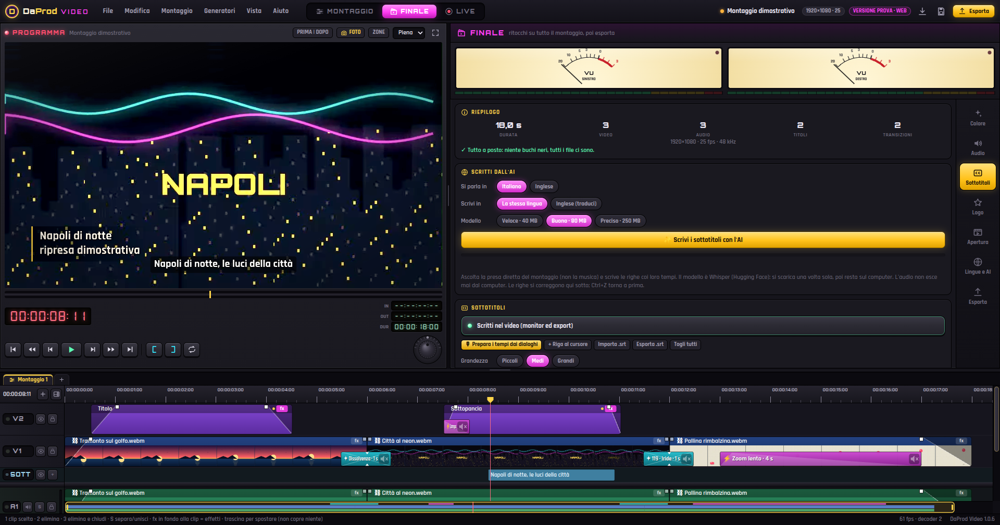
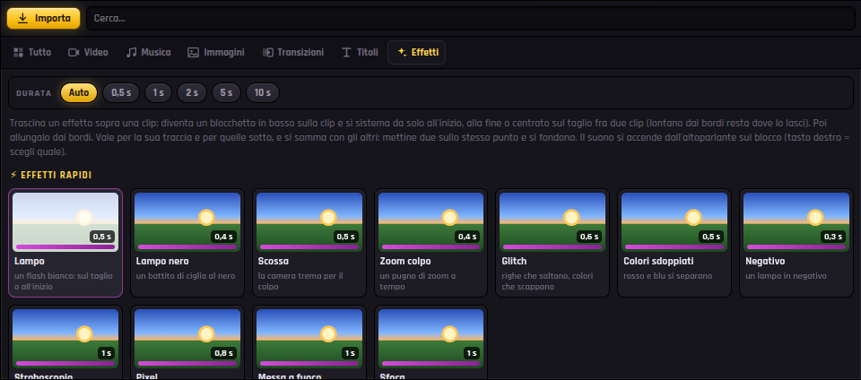
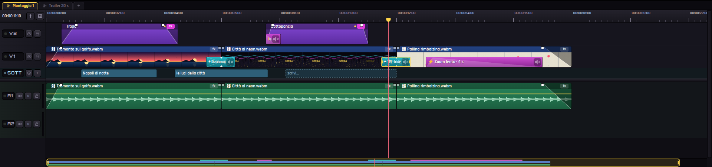
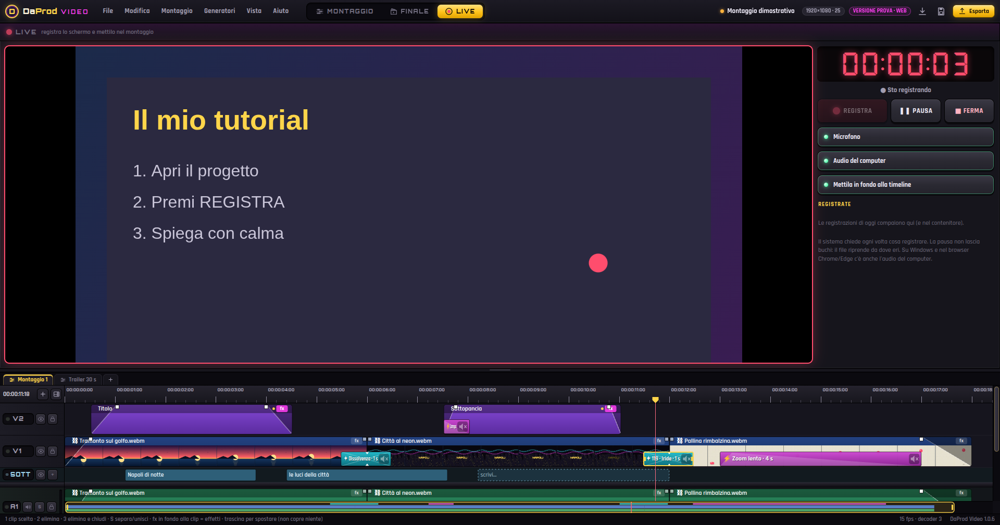

# DaProd · Video 🎬

[](https://cammo22.github.io/DaProdVideo/app/)

[](https://cammo22.github.io/DaProdVideo/)
[](https://github.com/cammo22/DaProdVideo/releases/latest)
[](CHANGELOG.md)
[](https://tauri.app/)
[](LICENSE)

Il **banco di montaggio DaProd**: vecchio stile, moderno dentro. Un monitor grande, il **contenitore** con
tutto in ordine (passa il mouse su un video e scorre), la **pulsantiera** con i tasti grandi, i **VU a
lancetta**, gli **FX a blocchetti sopra le clip** (effetti e transizioni, coi loro suoni), la titolatrice, i
**proxy automatici** per andare lisci anche coi file pesanti, la **pagina Finale** per colore, **sottotitoli
scritti dall'AI** (Whisper, sul tuo computer) e logo su tutto il montaggio, **più timeline** nello stesso
progetto, la pagina **LIVE** per registrare lo schermo (registra, pausa, ferma) e la **EDL**. Cursore sul punto, premi **1** e tagli, premi **2** ed elimini. Gira su **Windows, Mac e
Android** e, in versione prova, **nel browser**.


| La pagina Finale: i sottotitoli scritti dall'AI, col menu a destra | Il contenitore: effetti a blocchetti da trascinare |
| --- | --- |
|  |  |

| Il cubo 3D | Transizioni e proprietà |
| --- | --- |
|  |  |

| Più timeline e i sottotitoli nella riga SOTT | LIVE: registra lo schermo |
| --- | --- |
|  |  |

## ▶ Come si monta

1. **Importa** i video (pulsante *Importa*, `Ctrl+I`, o trascinali nel contenitore). Il primo video decide il formato del progetto.
2. Nel **contenitore** passa il mouse su un video: scorre avanti e indietro col puntatore. **Trascinalo** nella timeline, o premi **+** per metterlo al cursore (e il cursore va alla fine: +, +, + e hai la scaletta). Se lì è occupato va su una traccia libera: **niente viene coperto**.
3. Vuoi scegliere il pezzo? **Doppio clic**: si apre nel monitor come **sorgente**. Segna **attacco** (`I`) e **stacco** (`O`) e premi **`,`** (inserisci) o **`.`** (sovrascrivi). **Tab** torna al montaggio.
4. Cursore dove vuoi (la **rotella** va di un fotogramma alla volta, col suono) e **`1`**: taglio. Il pezzo più corto è già scelto: **`2`** e via, e si passa alla clip dopo. **`Q`** / **`W`** tolgono lo scarto a sinistra / a destra del cursore.
5. **Accendi le tracce** (clic sul nome) e il taglio tocca solo quelle. **`S`** separa l'audio dal video, o unisce più clip in un gruppo.
6. **Effetti e transizioni sono blocchetti sopra le clip**: una striscia sottile in basso sulla traccia video, niente corsia a parte. Trascina un **effetto** (lampo, scossa, zoom colpo, glitch, dal nero, zoom lento, camera a mano, bande cinema, e le **luci** e le **distorsioni**: bagliore, riflesso d'obiettivo, neon, onda, bolla, vortice, caleidoscopio…) sopra una clip: **si sistema da solo** all'inizio, alla fine o centrato sul taglio fra due clip (lontano dai bordi resta dove lo lasci), e vale per la sua traccia e per quelle sotto. Trascina una **transizione** (dissolvenza, passaggio al nero, spinta, zoom, mosaico, **cubo 3D**, girata, onda, lampo, glitch, tendine SMPTE con stella e cuore, frusta, rotazione, lama di luce, tenda, polvere…) vicino a un taglio: si centra da sola, e **più è lunga più è lenta**. Poi **allungali dai bordi**. Due o più sullo stesso punto **si sommano e si fondono**. Molti hanno già il **loro suono** (whoosh, colpo, zap, glitch, salita…), spento di partenza: l'**altoparlante sul blocco** lo accende con un clic, il **tasto destro sull'altoparlante** apre i suoni e **passandoci sopra li senti**. **Clic su un blocco o su una clip** e il pannello di destra mostra le sue impostazioni (📌 lo tiene sempre in vista). I blocchetti **seguono la clip** su cui stanno. Le clip non cambiano mai durata. Anche gli **effetti della clip** (Vivace, Caldo, Cinema, Pellicola, Vignetta…) si sommano fra loro.
7. Il **volume** è la linea gialla sulle clip audio: trascinala, doppio clic per un punto, tasto destro → *Abbassa qui*. I **quadratini in alto** agli angoli di ogni clip sono le dissolvenze: tirali verso l'interno. **Fade in, fade out, incrocio, eco, ovattato** si trascinano dal contenitore sulle clip audio. Il tasto **fx** in fondo alla clip accende gli effetti al volo.
8. **`F9`** apre la pagina **Finale**, col suo menu a destra: **colore** (automatico su tutto, look, ritocchi, prima/dopo), **audio** finale col limitatore, **sottotitoli** (**scritti dall'AI**: Whisper ascolta la presa diretta in italiano o in inglese, e dall'italiano li scrive anche direttamente in inglese; o i tempi dai dialoghi da riempire a mano; importa ed esporta .srt), **logo** sempre in vista, **apertura** e chiusura (clip, titoli, dal nero e al nero), **lingue e AI** ed **esporta** (MP4, MOV, WebM, WAV, EDL, .srt).
9. I **sottotitoli** stanno nella riga **SOTT**, fra le tracce video e quelle audio: **trascinali**, tira i bordi per i tempi, doppio clic per il testo, tasto destro per **unire** (appaiono insieme) o **dividere**. Nel Finale ogni riga ha i tasti ⇤ ⇥ − + per sistemare i tempi al volo.
10. **Più timeline**: le schede sopra la timeline, il **+** ne fa una nuova o una copia; doppio clic per rinominarla.
11. **`F10`** apre la pagina **LIVE**: **REGISTRA**, **PAUSA**, **FERMA**. La registrazione dello schermo (col microfono e l'audio del computer, se vuoi) finisce nel contenitore e in fondo alla timeline.
12. **`V`** stringe la timeline: **proprietà, mixer e VU scendono fino in fondo** a destra (di nuovo `V` per tornare larga). La **barra a destra** della timeline scorre su e giù fra le tracce.
13. **`P`** fa un'**istantanea** del fotogramma nel contenitore, da allungare quanto vuoi (**`Shift+P`**: fermo immagine al cursore).

### 🎛 La pulsantiera

| Tasto | Cosa fa | Tasto | Cosa fa |
| --- | --- | --- | --- |
| **1** | taglia al cursore (le tracce accese, o tutte) e sceglie il pezzo più corto | **5** | dissolvenza incrociata sul taglio più vicino |
| **2** | elimina la clip scelta (con la sua audio) e passa alla dopo | **6** | tendina sul taglio |
| **3** | elimina e chiude il buco (ripple) | **7** | passaggio al nero |
| **S** (o **4**) | separa un gruppo / unisce più clip in un gruppo | **8** | dissolvenza in apertura e chiusura |
| **Q** | via lo scarto a sinistra del cursore | **W** | via lo scarto a destra del cursore |

| Tasto | Cosa fa | Tasto | Cosa fa |
| --- | --- | --- | --- |
| `Spazio` | play / stop | `J` `K` `L` | shuttle indietro, fermo, avanti (ripeti: ×2 ×4 ×8 ×16) |
| `←` `→` rotella | un fotogramma, col suono (`Shift+←→`: un secondo) | `↑` `↓` | taglio precedente / successivo |
| `I` `O` | attacco e stacco (sul monitor) | `Shift+Q` | attacco e stacco sulla clip sotto il cursore |
| `,` `.` | inserisci / sovrascrivi dalla sorgente (`[` `]` su tastiera USA) | `E` `Invio` | EDIT nel modo attivo |
| `Z` `X` | solleva / estrai fra attacco e stacco | `Shift+R` | rivedi l'ultimo montaggio con il preroll |
| `Tab` | monitor: sorgente ↔ montaggio | `F` | abbina fotogramma (la sorgente nel monitor) |
| `Ins` | modo libero / inserisci | `R` `N` `B` | ripple, calamita, linee elastiche (trasparenza) |
| `F9` | pagina Montaggio ↔ pagina **Finale** | `F10` | pagina **LIVE** (registra lo schermo) |
| `V` | timeline stretta ↔ larga (proprietà e VU fino in fondo) | `Alt+Shift`+trascina | sposta la clip **e tutto quello dopo**, su tutte le tracce (come EDIUS) |
| `M` | marcatore | `T` | titolo al cursore · `G` zone di sicurezza |
| `P` | **istantanea** del fotogramma nel contenitore | `Shift+P` | **fermo immagine** di 2 s al cursore |
| `Ctrl+Z` `Ctrl+Y` | annulla / ripeti (200 passi) | `Ctrl+C` `X` `V` | copia, taglia, incolla le clip |
| tastierino `0-9` | scrive il timecode (`1000` = 10 s, `+25`) | `F1` | tutti i tasti |

Con il mouse: **trascina** per spostare (anche di traccia: si ferma contro le vicine, non copre niente), i
**bordi** per il trim, **Shift** sul taglio per il roll, **Alt** per lo slip, **Ctrl** per il trim ripple,
**Alt+Shift** per spostare la clip e tutto quello che viene dopo, su tutte le tracce, insieme.
**Rotella** = un fotogramma per scatto col suono, **Ctrl+rotella** = zoom, **Shift+rotella** = scorri,
**Alt+rotella** = su e giù fra le tracce. **Tasto destro** sulla clip: elimina lo scarto a sinistra/destra di
quel punto, transizioni all'inizio e alla fine, effetti a tempo, *Abbassa qui*; sul **blocchetto FX**: durata,
centra sul taglio, cambia, **suono** (quale, acceso/spento, volume), colore, "ripeti subito dopo"; sull'**altoparlante** del
blocchetto: i suoni, da sentire passandoci sopra; sulla **riga SOTT**: unisci, dividi, inizia e finisci al cursore. I menu
stanno sempre dentro lo schermo. La **barra in fondo è un navigatore**: trascina la
finestra gialla per scorrere, tira i suoi bordi per lo zoom. Ogni bordo fra i pannelli si trascina
(doppio clic lo chiude). **Doppio clic sull'immagine**: schermo intero con la timeline in piccolo e i VU.
Sul telefono: tocco = cursore, **tieni premuto** e trascina per spostare, **due dita** per lo zoom.

## 📥 App per Windows, Mac e Android

Ogni [release](https://github.com/cammo22/DaProdVideo/releases/latest) ha quattro file:

| | File | Come si usa |
| --- | --- | --- |
| 🪟 Windows | `DaProd-Video-X.Y.Z-portatile.exe` | niente installazione: doppio clic e parte. Se SmartScreen avvisa: *Ulteriori informazioni → Esegui comunque* |
| 💿 Windows | `DaProd-Video-X.Y.Z-setup.exe` | installa con il collegamento nel menu Start (senza permessi di amministratore) |
| 🍎 Mac | `DaProd-Video-X.Y.Z.dmg` | trascina in Applicazioni; la prima volta *tasto destro → Apri* (su Sequoia: *Impostazioni → Privacy e sicurezza → Apri comunque*) |
| 🤖 Android | `DaProd-Video-X.Y.Z.apk` | aprilo sul telefono e consenti l'installazione da origini sconosciute |

Le app sono fatte con **Tauri 2**: l'interfaccia gira nel motore web del sistema (WebView2 su Windows, WebKit
su Mac, Chromium su Android) e i file li legge e li scrive **Rust**. Pesano pochi MB, leggono ore di girato a
pezzi senza caricarle in memoria, scrivono l'export mentre esce e **riprendono il montaggio da dove eri**.
Requisiti: Windows 10/11, macOS 14 o più nuovo con Safari aggiornato (per l'audio serve WebKit 26), Android 8+.

**È tutto automatico** (`.github/workflows/app.yml`): quando su `main` arriva una versione nuova (il campo
`version` di `package.json`), GitHub Actions fa le prove, compila EXE, DMG e APK e pubblica da sola la release
`vX.Y.Z` con le note prese dal CHANGELOG. Per una versione nuova basta alzare `version`, scrivere la voce nel
CHANGELOG e unire.

**Aggiornarsi è un clic**: nell'app c'è il tasto **Aggiornamenti** in alto (si accende da solo quando esce una
versione nuova). Fa vedere le novità, scarica il file giusto (setup, portatile, DMG o APK) e lo apre. Alla prima
apertura dopo l'aggiornamento compaiono le **novità** della versione (sempre anche da *Aiuto → Novità*).

Per firmare l'APK con una chiave tua aggiungi ai segreti del repository `ANDROID_KEYSTORE_BASE64`,
`ANDROID_KEYSTORE_PASSWORD`, `ANDROID_KEY_ALIAS` e `ANDROID_KEY_PASSWORD`. Senza, la CI usa una chiave che tiene
nella sua cache (resta uguale fra le release, così gli aggiornamenti si installano sopra).

## 🌐 La versione prova su GitHub Pages

[`cammo22.github.io/DaProdVideo`](https://cammo22.github.io/DaProdVideo/) è la home; il banco è in
[`/app/`](https://cammo22.github.io/DaProdVideo/app/). È **completo** (montaggio, effetti, export), con
il **montaggio dimostrativo** generato al volo per provarlo senza file. I limiti sono quelli del browser:

- serve **Chrome, Edge, Brave, Opera** (anche su Android) o **Safari 26**: il motore è WebCodecs;
- i file restano nel browser: riaprendo, Chrome ed Edge chiedono di ridare il permesso (*File → Ricollega media*), gli altri di sceglierli di nuovo;
- l'export senza "Salva con nome" (Firefox, Safari) passa dalla memoria: per montaggi lunghi meglio l'app.

Ogni merge su `main` ricompila la home e il banco e li mette sul ramo `gh-pages` (`.github/workflows/pages.yml`).
Se il sito non si accende da solo, una volta sola: *Settings → Pages → Deploy from a branch → `gh-pages` / (root)*.

## 🛠 Come è fatto

| Pezzo | Con cosa |
| --- | --- |
| Lettura e scrittura dei media | [Mediabunny](https://mediabunny.dev) (MP4, MOV, MKV, WebM, MPEG-TS/AVCHD, MP3, WAV, FLAC, OGG) su **WebCodecs**, decodifica e codifica hardware; AC-3 delle videocamere con il decoder WASM; **proxy automatici** (960 px, un fotogramma chiave ogni mezzo secondo) fatti dietro le quinte e conservati nel disco privato (OPFS) |
| Mixer video | **WebGL2**: un buffer per strato, trasformazioni, proc amp, chiave, look, tendine SMPTE, effetti digitali e dissolvenze negli shader; il passaggio degli **effetti a tempo** dopo ogni traccia che ne ha (valgono per lei e per quelle sotto); colore automatico misurato su ogni ripresa, un passaggio finale per il colore di tutto il montaggio, e sopra a tutto logo e sottotitoli |
| Audio | **Web Audio**: volume e incroci come inviluppi, filtri per la voce, limitatore finale, audio a colpetti quando vai di fotogramma in fotogramma, VU dalla scheda audio, mixaggio dell'export a pezzi con `OfflineAudioContext` |
| Registrazione (LIVE) | `getDisplayMedia` per lo schermo, microfono e audio del computer mescolati con Web Audio, **MediaRecorder** con pausa; alla fine Mediabunny rimette in ordine il file (durata e ricerca) e l'app lo salva in *Video → DaProd Video* |
| Timeline | una sola **tela 2D** ridisegnata solo quando serve; miniature a potenze di due (zoomando si riusano) e forma d'onda a 100 picchi al secondo |
| Modello | fotogrammi interi sulla timeline (come le centraline a nastro), più timeline (sequenze) nello stesso progetto, annulla a fotografie del progetto |
| Sottotitoli AI | **Whisper** (tiny, base o small) con [transformers.js](https://huggingface.co/docs/transformers.js) in un worker, su WebGPU se c'è (se no WASM): la libreria arriva dalla CDN e il modello da Hugging Face **una volta sola**, poi restano in cache. L'audio della presa diretta si prende a 16 kHz, si taglia nei silenzi a pezzi di un minuto e **non esce mai dal computer** |
| App | **Tauri 2 / Rust**: `src-tauri/src/lib.rs` legge i media a pezzi, scrive l'export in streaming (anche `content://` su Android), salva progetti e autosalvataggio; `aggiorna.rs` scarica e apre la versione nuova |

```bash
npm install
npm run dev            # il banco in http://localhost:5173/app/
npm run build          # dist/: home + banco (quello che va su Pages e dentro le app)
npm run tauri dev      # l'app desktop in sviluppo (serve Rust)
npm run tauri build    # l'app desktop di rilascio
```

### ✅ Controlli automatici

```bash
npm run build
npx playwright install chromium
node test/prove.mjs    # oltre 130 prove: timecode, 1 taglia (e sceglie il pezzo corto), 2 elimina (e passa alla
                       # dopo), S separa/unisce, Q e W, tracce accese, rotella, niente viene coperto, volume
                       # trascinato, FX sulle clip (si attaccano ai bordi, seguono la clip, suoni accesi/spenti
                       # e nel mixaggio), Alt+Shift, maniglie delle dissolvenze, navigatore, pagina Finale
                       # (sottotitoli AI, logo, apertura), effetti che si sommano, menu dentro lo schermo,
                       # riga SOTT (sposta, unisci, dividi), più timeline, LIVE con pausa, novità, istantanea, tre punti dalla sorgente, play dal
                       # mezzo di una ripresa col GOP lungo e proxy, EDL, export WebM riletto
node test/foto.mjs     # foto del banco (computer, Finale, contenitore, timeline, LIVE, telefono) in test/.out/
```

### 📁 Dove sta cosa

- `src/core/` il modello: tipi, timecode (anche drop-frame), operazioni di montaggio, annulla, gli FX a blocchetti (`blocchi.ts`) e il catalogo dei loro suoni (`suoni.ts`), gli effetti della clip che si sommano (`effettiClip.ts`), le timeline (`sequenze.ts`), i sottotitoli.
- `src/media/` Mediabunny: contenitore, fotogrammi (flusso e ricerca), proxy automatici, banco audio.
- `src/render/` il piano di ogni fotogramma e il mixer WebGL2 (effetti a tempo, colore automatico e colore finale, logo e sottotitoli), titolatrice e countdown.
- `src/ui/` timeline, monitor, pulsantiera, contenitore, proprietà, pagina Finale, pagina LIVE (`live.ts`), mixer e VU, strumenti, finestre.
- `src/azioni.ts` tutti i comandi con i loro tasti · `src/effetti.ts` gli effetti al volo · `src/export/` export ed EDL · `src/demo.ts` il montaggio dimostrativo.
- `src-tauri/` l'app Rust, con `gen/android` per l'APK · `test/` le prove.
