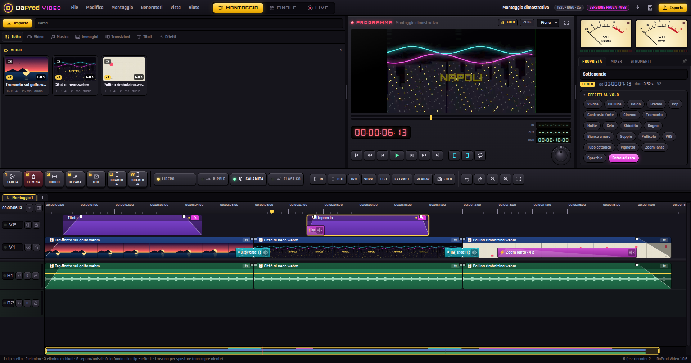
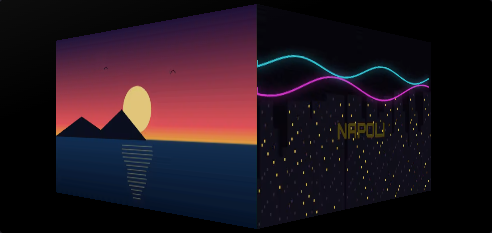
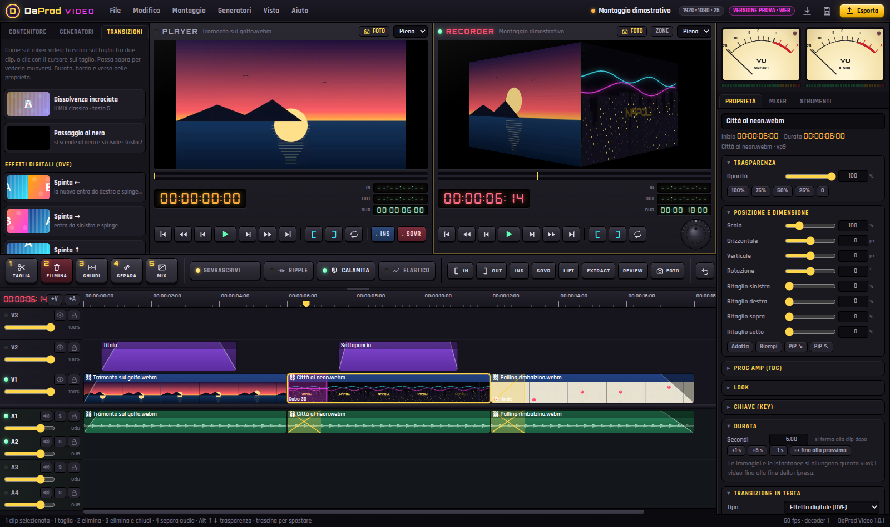

# DaProd · Video 🎬

[](https://cammo22.github.io/DaProdVideo/app/)

[](https://cammo22.github.io/DaProdVideo/)
[](https://github.com/cammo22/DaProdVideo/releases/latest)
[](CHANGELOG.md)
[](https://tauri.app/)
[](LICENSE)

Il **banco di montaggio DaProd**: vecchio stile, moderno dentro. Due monitor come in regia (**Player** e
**Recorder**), la **pulsantiera** con i tasti grandi, i **VU a lancetta**, le **tendine SMPTE**, la titolatrice
e la **EDL**. Cursore sul punto, premi **1** e tagli, premi **2** ed elimini. Gira su **Windows, Mac e
Android** e, in versione prova, **nel browser**.



| Il cubo 3D nel Recorder | Transizioni, FOTO e Durata |
| --- | --- |
|  |  |

## ▶ Come si monta

1. **Importa** i video (pulsante *Importa*, `Ctrl+I`, o trascinali nel contenitore). Il primo video decide il formato del progetto.
2. **Doppio clic** su un file: si apre nel **Player**. Segna **attacco** (`I`) e **stacco** (`O`).
3. Premi **`.`** per **sovrascrivere** (o **`,`** per **inserire**) nella timeline al cursore. Oppure trascina il file nella timeline.
4. Metti il cursore dove vuoi e premi **`1`**: taglio. Clic sul pezzo che non serve e **`2`**: via. **`3`** elimina e chiude il buco.
5. **`5`** mette la dissolvenza sul taglio, **`Alt`+`↑↓`** cambia la trasparenza al volo, **`B`** mostra le linee elastiche.
   Nel pannello **Transizioni** ci sono anche gli effetti digitali: spinta, zoom, mosaico, **cubo 3D**, girata, onda, lampo, luce di pellicola, glitch, vortice, sfocata, e le tendine a stella e a cuore.
6. **`P`** fa un'**istantanea**: il fotogramma sotto il cursore finisce nel contenitore come immagine, da mettere in timeline e allungare quanto vuoi (**`Shift+P`** la mette subito al cursore come fermo immagine).
7. **Esporta** il master (`Ctrl+M`): MP4, MOV, WebM o WAV. Oppure la **EDL** per un'altra sala.

### 🎛 La pulsantiera

| Tasto | Cosa fa | Tasto | Cosa fa |
| --- | --- | --- | --- |
| **1** | taglia al cursore (le clip selezionate, o tutte le tracce) | **5** | dissolvenza incrociata sul taglio |
| **2** | elimina la clip selezionata (con la sua audio) | **6** | tendina sul taglio |
| **3** | elimina e chiude il buco (ripple) | **7** | passaggio al nero |
| **4** | separa / unisci audio e video | **8** | dissolvenza in apertura e chiusura |

| Tasto | Cosa fa | Tasto | Cosa fa |
| --- | --- | --- | --- |
| `Spazio` | play / stop | `J` `K` `L` | shuttle indietro, fermo, avanti (ripeti: ×2 ×4 ×8 ×16) |
| `←` `→` | un fotogramma (`Shift`: un secondo) | `↑` `↓` `A` `S` | taglio precedente / successivo |
| `I` `O` | attacco e stacco (sul monitor attivo) | `Q` | attacco e stacco sulla clip sotto il cursore |
| `,` `.` | inserisci / sovrascrivi dal Player (`[` `]` su tastiera USA) | `E` `Invio` | EDIT nel modo attivo |
| `Z` `X` | solleva / estrai fra attacco e stacco | `Shift+R` | rivedi l'ultimo montaggio con il preroll |
| `Tab` | passa fra Player e Recorder | `F` | abbina fotogramma (la sorgente nel Player) |
| `Ins` | modo inserisci / sovrascrivi | `R` `N` `B` | ripple, calamita, linee elastiche |
| `M` | marcatore | `T` | titolo al cursore |
| `P` | **istantanea** del fotogramma nel contenitore | `Shift+P` | **fermo immagine** di 2 s al cursore |
| `Ctrl+Z` `Ctrl+Y` | annulla / ripeti (200 passi) | `Ctrl+C` `X` `V` | copia, taglia, incolla le clip |
| tastierino `0-9` | scrive il timecode (`1000` = 10 s, `+25`) | `F1` | tutti i tasti |

Con il mouse: **trascina** per spostare (anche di traccia), i **bordi** per il trim, **Shift** sul taglio per il
roll, **Alt** per lo slip, **Ctrl** per il trim ripple. Rotella = scorri, **Ctrl+rotella** = zoom. Sul telefono:
tocco = cursore, **tieni premuto** e trascina per spostare, **due dita** per lo zoom.

## 📥 App per Windows, Mac e Android

Ogni [release](https://github.com/cammo22/DaProdVideo/releases/latest) ha quattro file:

| | File | Come si usa |
| --- | --- | --- |
| 🪟 Windows | `DaProd-Video-X.Y.Z-portatile.exe` | niente installazione: doppio clic e parte. Se SmartScreen avvisa: *Ulteriori informazioni → Esegui comunque* |
| 💿 Windows | `DaProd-Video-X.Y.Z-setup.exe` | installa con il collegamento nel menu Start (senza permessi di amministratore) |
| 🍎 Mac | `DaProd-Video-X.Y.Z.dmg` | trascina in Applicazioni; la prima volta *tasto destro → Apri* (su Sequoia: *Impostazioni → Privacy e sicurezza → Apri comunque*) |
| 🤖 Android | `DaProd-Video-X.Y.Z.apk` | aprilo sul telefono e consenti l'installazione da origini sconosciute |

Le app sono fatte con **Tauri 2**: l'interfaccia gira nel motore web del sistema (WebView2 su Windows, WebKit
su Mac, Chromium su Android) e i file li legge e li scrive **Rust**. Pesano pochi MB, leggono ore di girato a
pezzi senza caricarle in memoria, scrivono l'export mentre esce e **riprendono il montaggio da dove eri**.
Requisiti: Windows 10/11, macOS 14 o più nuovo con Safari aggiornato (per l'audio serve WebKit 26), Android 8+.

**È tutto automatico** (`.github/workflows/app.yml`): quando su `main` arriva una versione nuova (il campo
`version` di `package.json`), GitHub Actions fa le prove, compila EXE, DMG e APK e pubblica da sola la release
`vX.Y.Z` con le note prese dal CHANGELOG. Per una versione nuova basta alzare `version`, scrivere la voce nel
CHANGELOG e unire.

Per firmare l'APK con una chiave tua aggiungi ai segreti del repository `ANDROID_KEYSTORE_BASE64`,
`ANDROID_KEYSTORE_PASSWORD`, `ANDROID_KEY_ALIAS` e `ANDROID_KEY_PASSWORD`. Senza, la CI usa una chiave che tiene
nella sua cache (resta uguale fra le release, così gli aggiornamenti si installano sopra).

## 🌐 La versione prova su GitHub Pages

[`cammo22.github.io/DaProdVideo`](https://cammo22.github.io/DaProdVideo/) è la home; il banco è in
[`/app/`](https://cammo22.github.io/DaProdVideo/app/). È **completo** (montaggio, effetti, export), con
il **montaggio dimostrativo** generato al volo per provarlo senza file. I limiti sono quelli del browser:

- serve **Chrome, Edge, Brave, Opera** (anche su Android) o **Safari 26**: il motore è WebCodecs;
- i file restano nel browser: riaprendo, Chrome ed Edge chiedono di ridare il permesso (*File → Ricollega media*), gli altri di sceglierli di nuovo;
- l'export senza "Salva con nome" (Firefox, Safari) passa dalla memoria: per montaggi lunghi meglio l'app.

Ogni merge su `main` ricompila la home e il banco e li mette sul ramo `gh-pages` (`.github/workflows/pages.yml`).
Se il sito non si accende da solo, una volta sola: *Settings → Pages → Deploy from a branch → `gh-pages` / (root)*.

## 🛠 Come è fatto

| Pezzo | Con cosa |
| --- | --- |
| Lettura e scrittura dei media | [Mediabunny](https://mediabunny.dev) (MP4, MOV, MKV, WebM, MPEG-TS/AVCHD, MP3, WAV, FLAC, OGG) su **WebCodecs**, decodifica e codifica hardware; AC-3 delle videocamere con il decoder WASM |
| Mixer video | **WebGL2**: un buffer per strato, trasformazioni, proc amp, chiave, look, tendine SMPTE e dissolvenze negli shader |
| Audio | **Web Audio**: linee elastiche e incroci come inviluppi, VU dalla scheda audio, mixaggio dell'export a pezzi con `OfflineAudioContext` |
| Timeline | una sola **tela 2D** ridisegnata solo quando serve; miniature a potenze di due (zoomando si riusano) e forma d'onda a 100 picchi al secondo |
| Modello | fotogrammi interi sulla timeline (come le centraline a nastro), annulla a fotografie del progetto |
| App | **Tauri 2 / Rust**: `src-tauri/src/lib.rs` legge i media a pezzi, scrive l'export in streaming (anche `content://` su Android), salva progetti e autosalvataggio |

```bash
npm install
npm run dev            # il banco in http://localhost:5173/app/
npm run build          # dist/: home + banco (quello che va su Pages e dentro le app)
npm run tauri dev      # l'app desktop in sviluppo (serve Rust)
npm run tauri build    # l'app desktop di rilascio
```

### ✅ Controlli automatici

```bash
npm run build
npx playwright install chromium
node test/prove.mjs    # oltre 50 prove: timecode, 1 taglia, 2 elimina, annulla, ripple, separa, dissolvenza,
                       # estrai, tre punti dal Player, trasparenza, istantanea e fermo immagine, transizioni
                       # digitali (cubo 3D, cuore, mosaico), riproduzione, EDL, export WebM riletto, telefono
node test/foto.mjs     # foto del banco (computer e telefono) in test/.out/
```

### 📁 Dove sta cosa

- `src/core/` il modello: tipi, timecode (anche drop-frame), operazioni di montaggio, annulla.
- `src/media/` Mediabunny: contenitore, fotogrammi (flusso e ricerca), banco audio.
- `src/render/` il piano di ogni fotogramma e il mixer WebGL2, titolatrice e countdown.
- `src/ui/` timeline, monitor, pulsantiera, contenitore, proprietà, mixer e VU, strumenti, finestre.
- `src/azioni.ts` tutti i comandi con i loro tasti · `src/export/` export ed EDL · `src/demo.ts` il montaggio dimostrativo.
- `src-tauri/` l'app Rust, con `gen/android` per l'APK · `test/` le prove.
